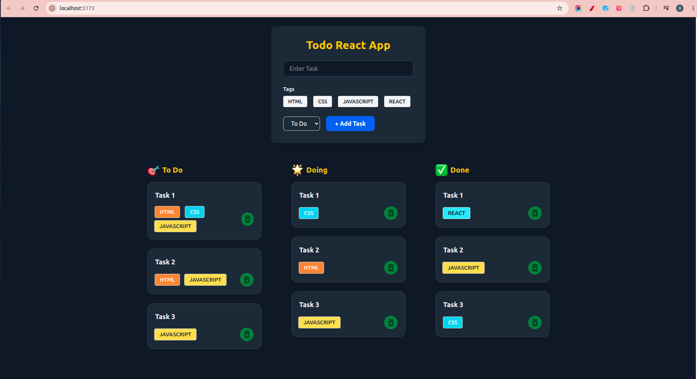

# TodoReactApp

A beautiful and responsive Todo application built with React and Tailwind CSS.  
Features include task management, tag selection, status columns, and a dark/light theme toggle.



## Features

- Add, edit, and delete tasks
- Organize tasks by status: To Do, Doing, Done
- Tag tasks with HTML, CSS, JavaScript, React
- Responsive layout for desktop and mobile
- Dark and light theme toggle
- State persistence with localStorage

## Technologies Used

- [React](https://react.dev/)
- [Tailwind CSS](https://tailwindcss.com/)
- [Vite](https://vitejs.dev/)

## Getting Started

1. **Clone the repository:**
   ```bash
   git clone https://github.com/yourusername/TodoReactApp.git
   cd TodoReactApp
   ```

2. **Install dependencies:**
   ```bash
   npm install
   ```

3. **Start the development server:**
   ```bash
   npm run dev
   ```

4. **Open in your browser:**
   ```
   http://localhost:5173
   ```

## Usage

- Click the theme toggle button to switch between dark and light mode.
- Add tasks using the form, select tags, and set status.
- Tasks are displayed in columns based on their status.
- Delete tasks using the delete button on each card.

## License

This project is licensed under the MIT License.